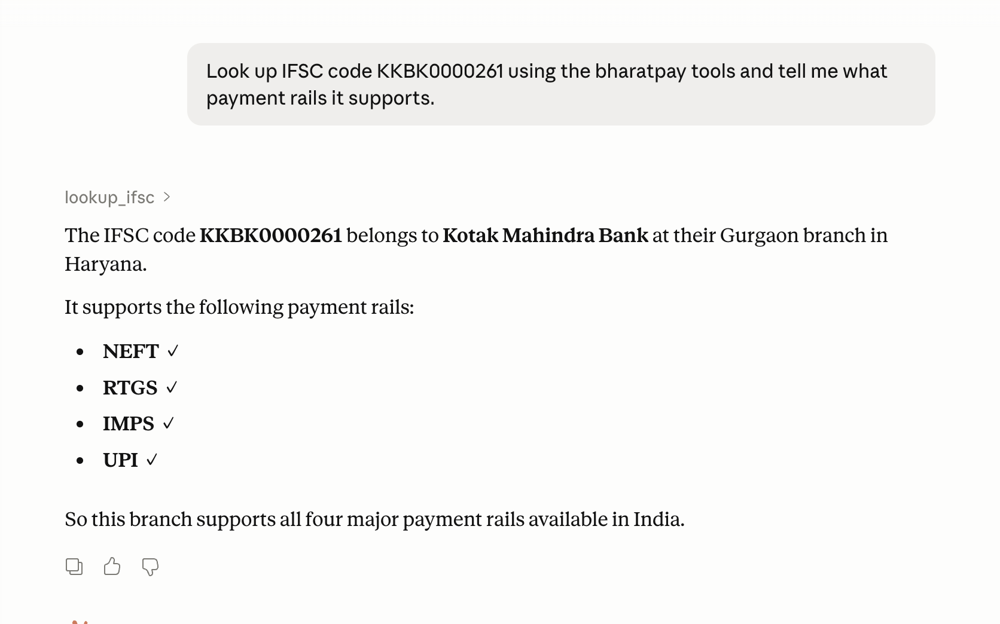

# 🇮🇳 BharatPay MCP

> **An MCP server that gives any AI agent — Claude Desktop, Cursor, Windsurf — instant access to Indian fintech utilities.** IFSC bank lookups, PAN/GSTIN validation with checksums, mutual fund NAVs, UPI VPA identification, pincode lookups, and Indian-style INR formatting. Seven tools. Zero auth. Zero cost. Designed to complement [Razorpay's official MCP server](https://github.com/razorpay/razorpay-mcp-server) — they handle execution, BharatPay handles validation and lookups.

🎥 **Demo coming soon** · 📦 **Install: `pip install -e .` from source** (PyPI publish in progress)

---

## Why this exists

Razorpay shipped an official MCP server in early 2025 for executing payment operations — creating orders, capturing payments, refunding. It's excellent.

But every Indian fintech project also needs a layer below that: **validation and enrichment**. Is this PAN's format correct? Does this GSTIN's mod-36 checksum verify? What bank does this IFSC code belong to? What's the PSP behind `user@oksbi`? What's today's NAV for Parag Parikh Flexi Cap?

Currently, an AI agent has to either hallucinate these answers or call seven different APIs with seven different auth schemes. **BharatPay collapses all of it into a single MCP server an agent can install in 30 seconds.**

Position-wise: BharatPay sits *next to* Razorpay's MCP, not in competition with it. They handle transactions; we handle validation. Use both together for a complete Indian-fintech AI stack.

--- 

## Demo

Claude Desktop autonomously calling `lookup_ifsc` for an Indian bank lookup:




---
## What's in the box

| Tool | Input | What it returns |
|---|---|---|
| `lookup_ifsc` | `KKBK0000261` | Bank, branch, address, MICR/SWIFT, supported rails (NEFT/RTGS/IMPS/UPI). Source: [Razorpay's open IFSC API](https://github.com/razorpay/ifsc). |
| `validate_pan` | `AABCT3518Q` | Format check, entity type (Individual/Company/HUF/Trust/...) decoded from the 4th character. |
| `validate_gstin` | `29AABCT1332L1ZS` | Format + mod-36 checksum verification, embedded state and PAN extraction. |
| `lookup_pincode` | `302001` | District, state, all post offices. Source: India Post API. |
| `get_mutual_fund_nav` | `parag parikh flexi cap` *or* `122639` | Latest NAV from AMFI's daily file. Fuzzy name search or exact code lookup. Cached for 6h. |
| `validate_upi_vpa` | `angelina@oksbi` | PSP identification (Google Pay/PhonePe/Paytm/...) and underlying bank from the handle suffix. |
| `format_inr` | `100000` *or* `29500` (paise mode) | `₹1,00,000` (Indian comma style) + word form (`1 Lakh`, `1.5 Crore`, etc.). |

## Architecture

```
┌─────────────────────┐                    ┌──────────────────────┐
│   AI Agent          │   MCP / stdio      │   BharatPay MCP      │
│   (Claude / Cursor) │ ─────────────────> │   (this server)      │
└─────────────────────┘                    └──────────┬───────────┘
                                                      │
                          ┌───────────────────────────┼───────────────────────────┐
                          │                           │                           │
                   ┌──────▼──────┐         ┌──────────▼─────────┐        ┌────────▼────────┐
                   │  Pure-logic │         │   Live HTTP APIs   │        │   Cached file   │
                   │  validators │         │ (no auth, no cost) │        │   (refreshed 6h)│
                   ├─────────────┤         ├────────────────────┤        ├─────────────────┤
                   │ PAN         │         │ ifsc.razorpay.com  │        │ AMFI NAVAll.txt │
                   │ GSTIN+mod36 │         │ postalpincode.in   │        │ (~6 MB, ~30K    │
                   │ UPI VPA     │         │                    │        │  schemes)       │
                   │ INR format  │         │                    │        │                 │
                   └─────────────┘         └────────────────────┘        └─────────────────┘
```

**Design notes worth calling out:**

1. **Validators are pure functions.** PAN, GSTIN, UPI, and INR run entirely offline — zero network, zero failures from API outages. The mod-36 GSTIN checksum is implemented from the GSTN spec (verified self-consistent: see `tests/test_validators.py::test_gstin_checksum_self_consistent`).
2. **Network tools are async.** IFSC and pincode lookups use `httpx.AsyncClient` so the MCP server can handle parallel tool calls without blocking.
3. **AMFI data is cached, not re-fetched per call.** A single 6 MB file covers all ~30,000 Indian mutual fund schemes; refreshing it on every NAV query would be wasteful and slow. Cache TTL: 6 hours.
4. **Tool descriptions are LLM-tuned.** Each tool's docstring is written for the *model* to read — explicit input formats, examples, and what it returns. This is what determines whether an agent successfully picks the right tool.
5. **No data leaves your machine for offline tools.** PAN/GSTIN/UPI/INR validation never touches the network. Useful for compliance-sensitive contexts.

## Install

### Option 1: pip (recommended)

```bash
pip install bharatpay-mcp
```

Then add to `~/Library/Application Support/Claude/claude_desktop_config.json` (Mac) or the Windows equivalent:

```json
{
  "mcpServers": {
    "bharatpay": {
      "command": "python",
      "args": ["-m", "bharatpay_mcp"]
    }
  }
}
```

Restart Claude Desktop. Look for the 🔌 icon — `bharatpay` should be listed.

### Option 2: From source

```bash
git clone https://github.com/angelina10504/bharatpay-mcp
cd bharatpay-mcp
pip install -e .
```

### For Cursor

Add to `.cursor/mcp.json` in your project:

```json
{
  "mcpServers": {
    "bharatpay": {
      "command": "python",
      "args": ["-m", "bharatpay_mcp"]
    }
  }
}
```

## Try it

Once connected, try these prompts in Claude Desktop:

> *"Look up IFSC code KKBK0000261 and tell me what payment rails it supports."*

> *"Is `29AAGCB7407Q1ZN` a valid GSTIN? If so, what state is the entity registered in?"*

> *"What's today's NAV for Parag Parikh Flexi Cap regular growth?"*

> *"My friend's UPI ID is `priya@oksbi` — which app does she use?"*

> *"Format ₹12,00,000 in Indian style and tell me what it would be in paise."*

The agent will autonomously pick the right tool. You'll see the tool call and its structured JSON response inline.

## Tests

```bash
pip install -e ".[dev]"
pytest tests/ -v
```

17 unit tests cover all offline validators including a self-consistency test for the GSTIN mod-36 checksum.

## What's next (V2)

- **`validate_aadhaar(number)`** — Verhoeff checksum (offline, no UIDAI API needed)
- **`get_holiday_calendar()`** — RBI bank holidays (settlement-day awareness)
- **`stock_quote(symbol)`** — NSE/BSE live quotes for `RELIANCE.NS`-style tickers
- **`tax_slab_calculator(income, regime)`** — Old vs new regime estimation
- **Bundle as `npx @bharatpay/mcp`** for zero-install distribution

Open an issue on GitHub if you want any of these prioritized.

## A note on "AI-first India"

When Razorpay [launched their MCP server](https://x.com/shashank_kr/status/1916426439785848867), they framed it as "designed for an AI-first world." That framing is right — but transactions are only half the picture. Half the engineering effort in any Indian fintech goes into **validation, enrichment, and lookups** that an AI agent can't reliably hallucinate. That's the gap BharatPay fills.

If you're building AI tools for Indian fintech and you find a utility missing, open an issue or send a PR.

## License

MIT — see [LICENSE](./LICENSE). All upstream APIs (Razorpay IFSC, India Post, AMFI) are themselves free and publicly available under their respective terms.

---

Built by Angelina Gupta · April 2026 
